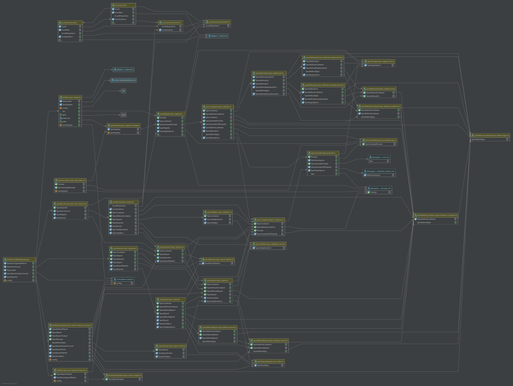

# TestNext
Test-Framework zur Anwendung auf verschiedenen Abstraktionsstufen, basierend auf Angular/TypeScript.
Test-framework for the usage on different levels of abstraction, in Angular/TypeScript

## Table of Contents
1. How-To

  1.1. Write Specs

  1.2. Run Tests

2. Structure of the Framework

## How-To
### Write Specs
* With TestNext Specs are written as classes
* A basic Spec is defined by 
  * at least one Given
  * exactly one When 
  * at least one Then step.
* the Spec will be executed in Order Given --> When --> Then
* class-names using TestNext in any way must be unique
  
#### Spec Classes
* A class with the decorator `@Spec('Spec-description')` is a SpecClass and will be executed as Spec.
Example
```
@Spec('Testing Example')
 class TestExample{
  [...]    
 }
```
* one Spec-description (argument for Spec) can be used multiple times
* The class-name of a SpecClass must be unique in the whole project

#### Spec-Methods
* Spec-Methods are marked with Decorators
  * Spec-Methods can be used in each class, the Class does not need to have a Spec-Decorator (look Inheritance)
* The Spec-methods will be executed in a specific order
  * Given --> When --> Then/ThenThrow --> Cleanup
* the methods
  * the method-name is a identifier and can only be used once per SpecClass (even with 'static'-modifier)
  * The methods must not have arguments
* Spec-Method-Description
  * Spec-Methods get a description, as first Argument in the Decorator
  * one description can be used multiple times
* ExecNumber
  * optional
  * for Spec-Method-Types which can appear multiple times in on Spec a execNumber can be given as second decorator-argument 
  * useful, when the execution order of the Spec-Methods matters
  
##### Given
* Given-methods will be executed first, while executing the SpecClass
* There must be at least one Given-method, multiple are possible
* They are marked with `@Given('description')` or `@Given('description', 1)` 

##### When
* Then When-methods will be executed second, while executing the SpecClass
* There can only be one When-method
* it is marked with `@When('description')`

##### Then
* Then-methods will be executed third, while executing the SpecClass
* There must be at least one Then-method, multiple are possible
* They are marked with `@Then('description')` or `@Then('description', 1)` 

##### ThenThrow
* The ThenThrow-method is an alternative to then Then-methods
* It is used, when the When-method is expected to throw an Error
* in the Method an Error should be thrown (this is not forced but would you use it otherwise)
* there can ony be one ThenThrow-method
* The error-type and the message are compared
* They are marked with `@ThenThrow('an error')`

##### Cleanup
* The Cleanup-methods are executed als last-method, while executing the SpecClass, even when the methods before failed
  * useful for example, when cleaning up a Database in the end
* It is optional, there can be multiple
* They are marked with `@Cleanup()`
  * a description is optional and can be given with `@Cleanup('description')`
  * an execNumber is optional and can be given with `@Cleanup('description', 1)`

#### Subject
* For a better overview SpecClasses can be assigned to Subjects
* One Subject can contain multiple SpecClasses
* one SpecClass can be assigned to multiple Subjects
* A Subject is assigned to a SpecClass with `@Subject('Subject Name')`

#### Inheritance
* A SpecClass can be extended and inherit
* The extended Class do not have to be a SpecClass (must not be marked with  `@Spec()`)
  * the child-SpecClasses will be Executed as long as the have the @Spec-Decorator
* All the methods can be inherited (Given, When, Then, ThenThrow, Cleanup)
  * If there can only one method of the type (as in When), the parents method is only used, when the child does not have an own
  * In the end The inheriting SpecClass must have at least one Given, exactly one When and at least one Then
* Execution-order
  * the usual method Order remains as it was, but the parent-Methods are executed before the Child Methods 
  * e.g. first all Parent-Given, then all Child-Given, then the Parents When or the child When
  * the execution-numbers only refer to the methods inside the SpecClass (so parent and child separated)
* Careful when inheriting:
  * overriding methods by their name can cause trouble

#### Generate
* It is possible to generate an object of a type on a class-Property
* Use the `@Generate(TypeToGenerate, providerArray)` decorator on a class-property
  * the provider-Array contains the dependencies of the type like `{provide:Dependency, mock:mockObj}`
    * it is possible to give:
      * useClass: alternative class for Provider, seen as real implementation for integrationtesting
      * useObject: alternative object for Provider, seen as real implementation for integrationtesting
      * mockClass: class to mock Provider, used in unittests
      * mockObject: object to mock Provider, used in unittests
      * mock: short for mockObject
  * when no mock is given the real-dependency is always used, Classes are favored over Objects 
  * choose whether the  mock or real-implementation should be used, when you execute the tests


#### Take Care
* Use unique SpecClass-Names
* overriding SpecMethods can cause Errors
* if you use variables in the Decorator-descriptions, they must be from static

### Asserts
* Class to check weather a value fits an expected value
* Created with `Assert.that(value, 'value Description')`
* the Description is optional
* Comparisons are added like `Assert.that(value, 'value Description').equals(otherValue, 'other Description')`
  * Comparing operators are: `equal(val)`, `isGreaterThan(val)`, `isLessThan(val)`,`isGreaterOrEquals(val)`, `isLessOrEquals(val)`, `isNull()`
  * it is possible to invert the comparison by using a `not` before the operation like `Assert.that(value).not.equals(otherValue)`
* if the comparison is negative an `AssertionError` is thrown
   
### Run Tests
#### CLI
```shell
npm run tNxt <runMode> [<runModeArguments>] <mock?> <outputModifier[...]>
```
* use `npm run tNxt` for help 
##### RunModes
* `AllSpecs`
  * execute all Specs
  * no additional Arguments
* `AllSubjects`
  * execute all Specs by their Subject
    * Print them ordered by the Subject
    * each Spec will only executed once (but printed for each Subject) 
  * no additional Arguments
  * Specs without Subject will also be executed, as '# Without Subject'
* `Subject`
  * runModeArgument: `SubjectName`
  * execute all Specs of the given Subject
* `Spec`
  * runModeArgument: `<SpecClassName>`
    * name of the Class with the Spec to Execute, not the description
  * the one Spec with the ClassName will be executed
  * inherited classes will not be executed separately

##### mock
With the mock-Modifier you can decide for the Generate-Decorator if it should use the mock-Value or the real-implementation.   
If you want to use the real-implementation, simply omit this modifier.

##### outputModifier
 * change the output hand have no influence on the running
 * the Modifier can be combined freely
 * by standard
  * only failed and invalid Specs are shown
  * Specs are ordered by their heading and then alphabet
 
 ###### show all
 * `sAll`
 * show all results of executable Specs (including ignored Specs)
 
 ###### hide ignored
  * `hIgn`
  * useful in addition to `sAll`
  * hides ignored Specs
 
  ###### show non Executable
  * `sNonExec`
  * show also non Executable SpecClasses (Classes having without @Spec, but other Spec-Decorator, e.g. a Given Method for inheritance)
  * useful for debugging 
  
  ###### hide Cleanup
  * `hClean`
  * hides the Cleanup-Description, when not failed
  * useful, when output needs to be shortened
  
  ###### order by Alphabet
  * `oAlpha`
  * order output by alphabet
 
 ###### order by ExecutionStatus
   * `oExecStat`
   * order output by ExecutionStatus/Success
    * Failed-->Invalid-->Successful-->Ignored-->nonExecutable

## Structure of the Framework
In SpecClasses you can use the Decorators provided by this Framework.
The Decorators access a registry and save all Data given there. Each SpecClass gets a SpecContainer.

The SpecContainer stores all for one Spec. It contains e.g. a Description, weather the Spec is ignored and so on. It contains also all Data for the Methods of a Spec decorated with the "@Given" or "@Then" etc, in properties with separated Classes. the Properties with "@Generate" are saved also there.

To use the Spec the SpecContainer can generate an Object of the Spec, ob which the Methods can be applied.

To Run a Spec the SpecRunner is used. It runs a single Spec, using the SpecContainer. It creates a SpecReport, which it saves into a SpecReporter. The SpecRunner lets the SpecContainer create an Object. The Object gets validated, if invalid this is reported in the Report and the SpecRunner ends. If the Spec-Object is valid, the SpecRunner starts executing the Spec Methods Given, When, Then and Cleanup. All Errors occurring, unforeseen errors and Assertion Errors get logged in the Report. If there are no Errors, the success is logged.

To choose which Specs to run and to run multiple Specs the Class SpecExecChooser loads the Specs from the SpecRegistry and starts all the SpecRunner. It gets the specRegistry and the SpecReporter as arguments.

The SpecExecChooser is started from the function runTestNext in the file "src/testExec/TestNextRunning.ts". it is necessary to start the process with the function, because it must be possible to run it from JavaScript.  In the Function the run-arguments are parsed and the execution of the Specs is triggered, with the registry and a SpecReporter. After the Specs are executed the Output is specified and started, based on the SpecReports. 


